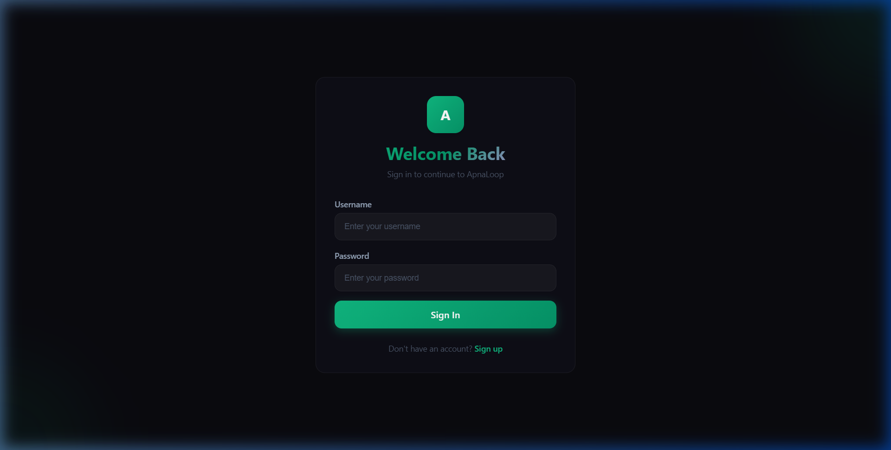
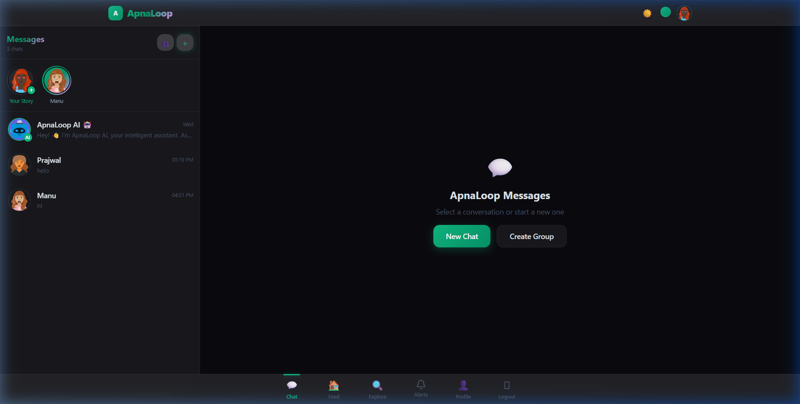
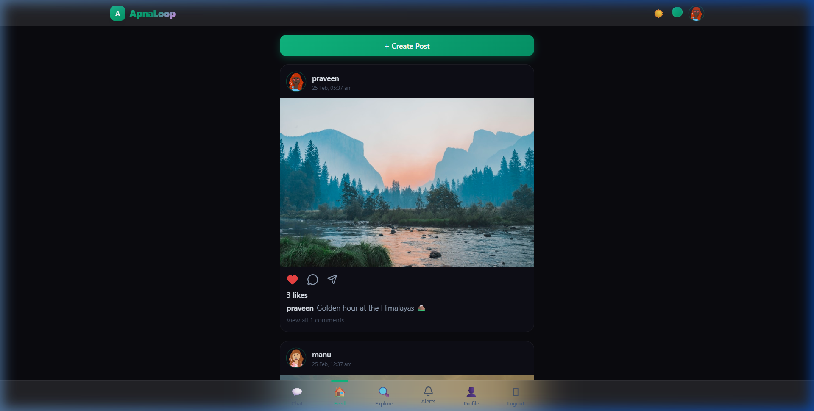
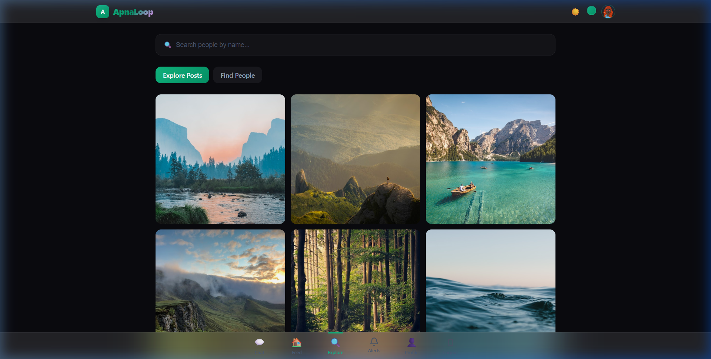

<div align="center">

# 🔄 ApnaLoop

### *A Premium Social Media Platform — Built for India* 🇮🇳

[](https://fastapi.tiangolo.com/)
[](https://react.dev/)
[](https://vitejs.dev/)
[](https://tailwindcss.com/)
[](https://sqlite.org/)
[](https://developer.mozilla.org/en-US/docs/Web/API/WebSocket)

**Real-time chat • Social feed • Stories • AI assistant • Glassmorphism UI**

*Experience the next generation of social networking with liquid glass design, real-time WebSocket messaging, and an intelligent AI chatbot — all in one platform.*

---

</div>

## 📸 Screenshots

<div align="center">

| Login | Chat |
|:---:|:---:|
|  |  |

| Feed | Explore |
|:---:|:---:|
|  |  |

</div>

---

## ✨ Features

### 💬 Real-Time Chat
- **WebSocket-powered** instant messaging — no page refresh needed
- **1-on-1 & Group chats** with member management
- **Emoji reactions** (👍 ❤️ 😂 😮 😢 🔥) on messages with live sync
- **Message status ticks** — Sent ✓, Delivered ✓✓, Read ✓✓ (blue)
- **Chat customization** — wallpaper themes & bubble color picker
- **Clear chat** functionality
- **AI Chatbot** — Talk to ApnaLoop AI for smart conversations

### 📱 Social Feed
- **Create posts** with image upload + captions
- **Like with micro-animations** — double-tap ❤️ burst effect
- **Comment tray** — Instagram-style sliding panel with real-time updates
- **Share posts** via Web Share API or clipboard
- **Full-screen Post Modal** — click any post for immersive viewing

### 🔍 Explore & Discover
- **Post discovery grid** with hover overlays (♥ likes + 💬 comments)
- **User search** — find people by name
- **Tabbed interface** — switch between Posts and People

### 📖 Stories
- **Upload stories** with image preview
- **Story bar** with gradient ring indicators
- **Full-screen story viewer** with auto-progress bar
- **Springy success toast** on upload completion
- **5-second auto-dismiss** with manual close

### 👤 User Profiles
- **Editable profiles** — avatar, display name, bio
- **Avatar zoom/crop** slider
- **Post grid** with click-to-open modal
- **Follower/Following lists** in modal views
- **Follow/Unfollow** with real-time count updates
- **Direct message** button to start chats

### 🔔 Notifications
- **Real-time notification count** in bottom nav (pulsing badge)
- **Like, comment, follow** notifications with actor avatars
- **Unread indicators** with accent dot
- **Auto mark-as-read** when page opens

### 🎨 Design System
- **Glassmorphism / Liquid UI** — `backdrop-blur(40px)` + translucent borders
- **Dark theme** with custom CSS variables
- **Accent color picker** — personalize the entire app
- **Framer Motion animations** — spring physics, smooth transitions
- **Skeleton loaders** — premium loading states
- **Responsive design** — works beautifully on mobile & desktop
- **Inter font** — clean, modern typography via Google Fonts

---

## 🏗️ Tech Stack

<div align="center">

| Layer | Technology |
|:---:|:---|
| **Frontend** | React 19 + Vite 7 + TailwindCSS v4 |
| **Animations** | Framer Motion 12 |
| **Icons** | Lucide React |
| **Routing** | React Router v7 |
| **HTTP Client** | Axios |
| **Backend** | FastAPI (Python) |
| **Database** | SQLite + aiosqlite (async) |
| **ORM** | SQLAlchemy 2.0 (async) |
| **Auth** | JWT (python-jose) + bcrypt |
| **Real-time** | Native WebSocket |
| **File Storage** | Local filesystem (`/uploads/`) |

</div>

---

## 🗂️ Project Structure

```
ApnaLoop/
├── backend/
│   ├── main.py              # FastAPI app entry + CORS + lifespan
│   ├── database.py          # SQLAlchemy async engine + session
│   ├── models.py            # User, Post, Comment, Like, Story, etc.
│   ├── schemas.py           # Pydantic models
│   ├── auth.py              # JWT + bcrypt authentication
│   ├── requirements.txt     # Python dependencies
│   └── routes/
│       ├── auth_routes.py       # Login / Register
│       ├── user_routes.py       # Profile, Follow, Search
│       ├── post_routes.py       # CRUD posts, Likes, Comments
│       ├── chat_routes.py       # Conversations, Messages, WebSocket
│       ├── story_routes.py      # Story upload & retrieval
│       ├── notification_routes.py  # Notification feed
│       ├── ai_routes.py         # AI chatbot endpoint
│       └── upload_routes.py     # File upload handler
│
├── frontend/
│   ├── src/
│   │   ├── App.jsx          # Routes + Layout
│   │   ├── api.js           # Axios instance + interceptors
│   │   ├── utils.js         # Shared utilities (getImageUrl)
│   │   ├── index.css        # Design system + Glassmorphism
│   │   ├── context/
│   │   │   ├── AuthContext.jsx   # Auth state management
│   │   │   └── ThemeContext.jsx  # Theme + accent color
│   │   ├── components/
│   │   │   ├── TopBar.jsx       # App header + branding
│   │   │   ├── BottomNav.jsx    # Navigation bar
│   │   │   └── PostModal.jsx    # Full-screen post viewer
│   │   └── pages/
│   │       ├── Login.jsx        # Sign in
│   │       ├── Register.jsx     # Sign up
│   │       ├── Chat.jsx         # Messaging + Stories
│   │       ├── Feed.jsx         # Social feed
│   │       ├── Explore.jsx      # Discover posts & people
│   │       ├── Profile.jsx      # User profiles
│   │       └── Notifications.jsx # Activity feed
│   ├── package.json
│   └── vite.config.js
│
├── screenshots/             # App screenshots for README
└── .gitignore
```

---

## 🚀 Quick Start

### Prerequisites
- **Python 3.10+** — [Download](https://www.python.org/downloads/)
- **Node.js 18+** — [Download](https://nodejs.org/)

### 1. Clone the repo

```bash
git clone https://github.com/Shriiiiii/-ApnaLoop.git
cd -ApnaLoop
```

### 2. Start the Backend

```bash
cd backend
python -m venv .venv

# Windows
.venv\Scripts\Activate.ps1

# Mac/Linux
source .venv/bin/activate

pip install -r requirements.txt
uvicorn main:app --reload
```

✅ Backend runs at `http://localhost:8000`

### 3. Start the Frontend

```bash
cd frontend
npm install
npm run dev
```

✅ Frontend runs at `http://localhost:5173`

### 4. Open the App

Navigate to **http://localhost:5173** — Register a new account and start exploring!

---

## 🔌 API Endpoints

<details>
<summary><strong>🔐 Authentication</strong></summary>

| Method | Endpoint | Description |
|--------|----------|-------------|
| `POST` | `/api/auth/register` | Create new account |
| `POST` | `/api/auth/login` | Login & get JWT token |
| `GET` | `/api/auth/me` | Get current user |

</details>

<details>
<summary><strong>👤 Users</strong></summary>

| Method | Endpoint | Description |
|--------|----------|-------------|
| `GET` | `/api/users/search?q=` | Search users |
| `GET` | `/api/users/{id}` | Get user profile |
| `PUT` | `/api/users/me` | Update profile |
| `POST` | `/api/users/me/avatar` | Upload avatar |
| `POST` | `/api/users/{id}/follow` | Follow user |
| `DELETE` | `/api/users/{id}/follow` | Unfollow user |
| `GET` | `/api/users/{id}/followers` | List followers |
| `GET` | `/api/users/{id}/following` | List following |

</details>

<details>
<summary><strong>📸 Posts</strong></summary>

| Method | Endpoint | Description |
|--------|----------|-------------|
| `POST` | `/api/posts` | Create post (multipart) |
| `GET` | `/api/posts/feed` | Get following feed |
| `GET` | `/api/posts/explore` | Get explore feed |
| `GET` | `/api/posts/user/{id}` | Get user's posts |
| `POST` | `/api/posts/{id}/like` | Toggle like |
| `GET` | `/api/posts/{id}/comments` | Get comments |
| `POST` | `/api/posts/{id}/comments` | Add comment |

</details>

<details>
<summary><strong>💬 Chat</strong></summary>

| Method | Endpoint | Description |
|--------|----------|-------------|
| `GET` | `/api/chat/conversations` | List conversations |
| `POST` | `/api/chat/conversations` | Start new chat |
| `POST` | `/api/chat/groups` | Create group chat |
| `GET` | `/api/chat/conversations/{id}/messages` | Get messages |
| `DELETE` | `/api/chat/conversations/{id}/messages` | Clear chat |
| `WS` | `/api/chat/ws?token=` | WebSocket connection |

</details>

<details>
<summary><strong>📖 Stories & Notifications</strong></summary>

| Method | Endpoint | Description |
|--------|----------|-------------|
| `GET` | `/api/stories` | Get all stories |
| `POST` | `/api/stories` | Upload story |
| `GET` | `/api/notifications` | Get notifications |
| `POST` | `/api/notifications/read` | Mark all read |
| `GET` | `/api/notifications/unread-count` | Unread count |

</details>

---

## 🌐 Deployment

This app is **deployment-ready** with environment variable support:

| Variable | Where | Purpose |
|----------|-------|---------|
| `VITE_API_URL` | Frontend | Backend URL (e.g. `https://apnaloop-api.onrender.com`) |
| `SECRET_KEY` | Backend | JWT signing key |

**Recommended:** Deploy on [Render.com](https://render.com) (free tier available)
- Backend → **Web Service** (Python)
- Frontend → **Static Site** (Vite build)

---

## 🧑‍💻 Author

**Shriiiiii** — [GitHub](https://github.com/Shriiiiii)

---

<div align="center">

### Made with ❤️ in India 🇮🇳

*If you found this useful, give it a ⭐ on GitHub!*

</div>
